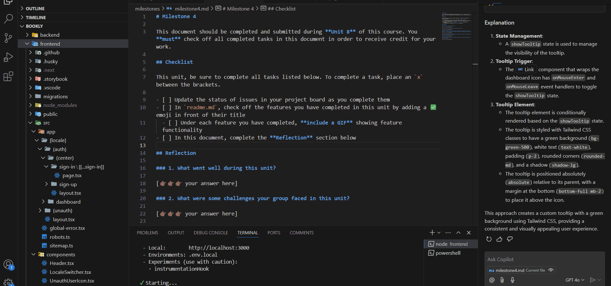

# Bookly 📚

CodePath WEB103 Final Project

Designed and developed by: Nguyen Le, Albert C, Jason Tang

🔗 Link to deployed app:

## About

### Description and Purpose

Bookly combines Tinder's engaging swipe mechanics with personalized music recommendations. Find your next favorite book and the perfect soundtrack to accompany your reading experience!

### Inspiration

Struggle finding the perfect songs to vibe to while reading? We got you covered. While platforms like Goodreads help discover books and Spotify suggests music, there wasn't a solution that connected these two experiences in an engaging way.

## Tech Stack

Frontend:

- React
- Next.js
- TailwindCSS
- Ant Design
- Shadcn/ui?

Backend:

- NestJS
- RESTful API
- OAuth
- PostgreSQL & Prisma ORM
- Redis for caching

External APIs:

- Spotify API for music integration
- OpenAI API for mood analysis
- Google Books API for book data

## Features

### User Sign-In and Sign-Up Pages ✅
- Users can create a new account or sign up with username/password or OAuth
- Redirects after successful logins and logouts
- Restricted access for certain pages, accessible only when user is logged in 



### Swipe-Based Book Discovery

- Tinder-like interface for book recommendations
- Personalized suggestions based on preferences
- Quick view of book details and ratings
- Smooth animations and intuitive gestures

[gif goes here]

### AI-Powered Music Matching

- Intelligent mood analysis of books
- Automatic playlist generation
- Spotify integration for instant listening
- Customizable mood matching preferences

[gif goes here]

### Personal Collections

- Create and manage book-music collections
- Organize by mood, genre, or theme
- Share collections with other users

[gif goes here]

## Additional features (considering)

### Social Features

- Share favorite book-music combinations
- Connect with readers of similar taste
- Discover popular combinations
- Follow curators for recommendations

### Smart Analytics

- Track reading and listening patterns
- View mood correlation insights
- Get personalized recommendations
- Monitor reading goals progress

## Installation Instructions

Prerequisites

- Node.js >= 16
- PostgreSQL >= 13
- Redix >= 6
- Spotify Developer Account

1. Clone the repository

```bash
git clone https://github.com/yourusername/bookly.git
cd bookly
```

2. Install dependencies

```bash
# Install frontend dependencies
cd frontend
npm install
npm run dev
# http://localhost:3000

# Install backend dependencies
cd ../backend
npm install
docker compose up -d postgres
npm run start:dev
```

## License

Copyright 2024 Nguyen Le

Licensed under the Apache License, Version 2.0 (the "License"); you may not use this file except in compliance with the License. You may obtain a copy of the License at

> http://www.apache.org/licenses/LICENSE-2.0