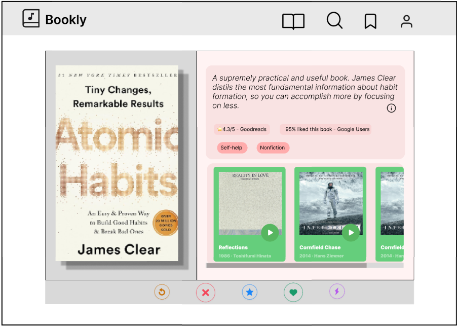
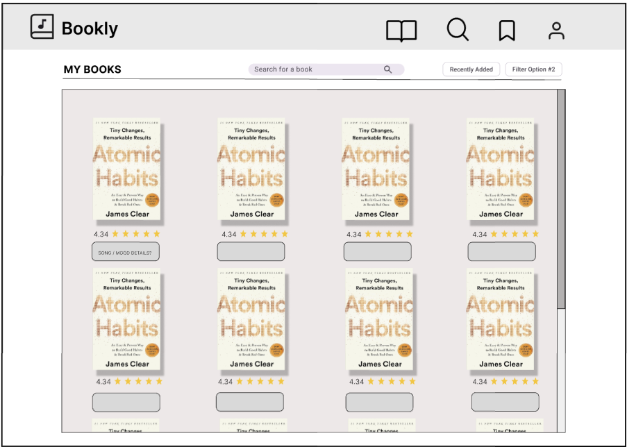
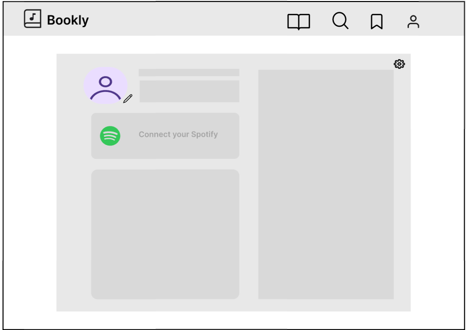
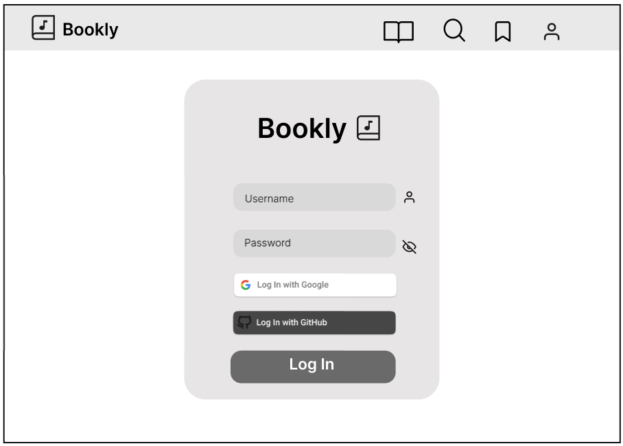

# Wireframes

Reference the Creating an Entity Relationship Diagram final project guide in the course portal for more information about how to complete this deliverable.

## List of Pages

[👉🏾👉🏾👉🏾 List the pages you expect to have in your app, with a ⭐ next to pages you have wireframed]
- Main Page which contains core swiping functionality ⭐
- Personal Profile page, contains collection of books saved ⭐
- User Profile page, view user analytics and profile descriptions ⭐
- Login Page ⭐
- Signup Page
- Social Page
- Individual Book Pages

## Wireframe 1: Main Page (contains swiping feature)

## Wireframe 2: Book Details Page

## Wireframe 3: User Profile Page

## Wireframe 4: Login Page

